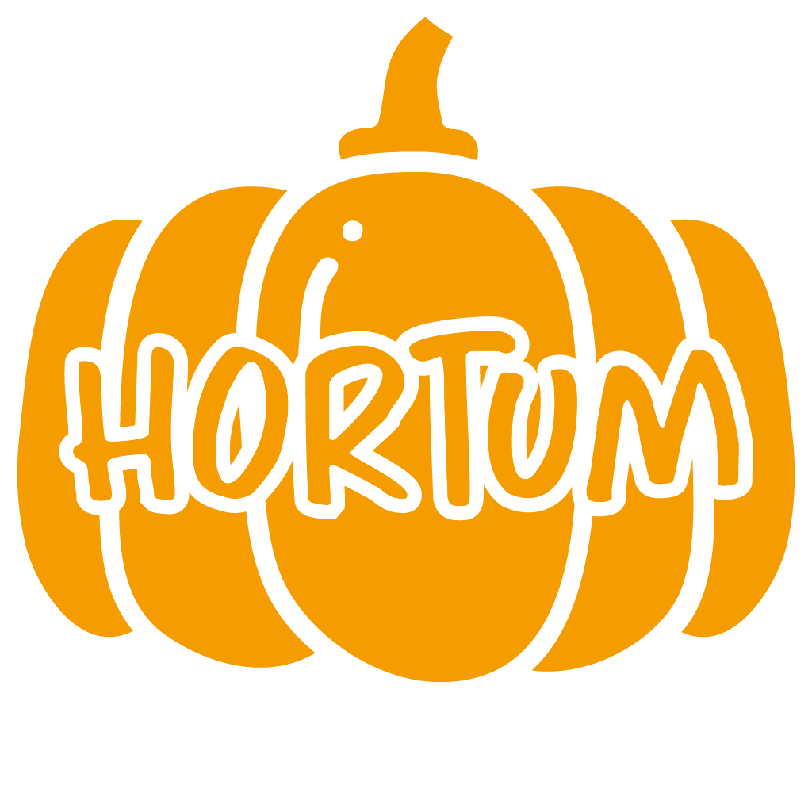

# Hortum



## Sobre
O projeto Hortum vem para auxiliar e promover a divulgação das produções de pequenos produtores, com o intúito de auxiliar suas vendas em um aplicativo de fácil utilização.

## Documentação
Para entender um pouco mais sobre o Hortum, acesse a nossa [documentação](https://fga-eps-mds.github.io/2020.2-Hortum/).

## Instalação
Para utilizar o aplicativo, siga o passo a passo a seguir de instalação e utilização.

#### Pré-requisitos
* [Git](https://git-scm.com/)
* [Docker](https://www.docker.com/get-docker)
* [Docker-composer](https://docs.docker.com/compose/install/#install-compose)

#### Utilização
> Clone o repositório no diretório desejado
```bash
$ git clone https://github.com/fga-eps-mds/2020.2-Hortum.git
$ cd 2020.2-Hortum
```

> Suba o backend
```bash
$ docker-compose up
```
