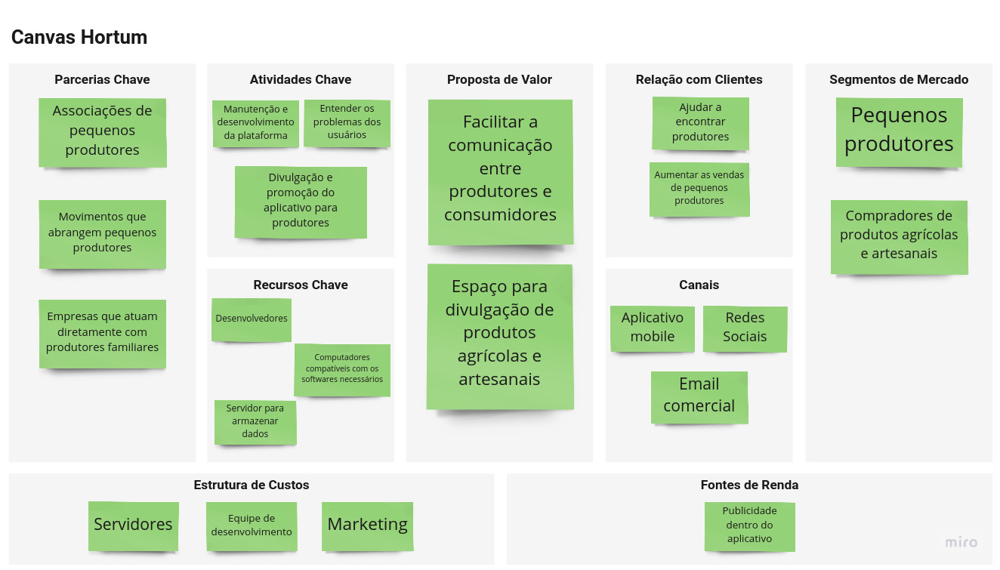

# Canvas

## Histórico de Revisão

Data|Versão|Descrição| Autor(es)
--|--|--|--
01/03/2021|1.0|Adição do canvas|Brenno Oliveira e Victor Lima
01/04/2021|2.0|Atualizado parcerias chaves e estrutura de custos|Brenno Oliveira
13/04/2021|3.0|Atualizado parcerias chaves, estrutura de custos, proposta de valor, atividade chave e canais | Brenno Oliveira, Carlos Eduardo, João Pedro, Lucas Braun, Matheus e Victor Lima

## 1. Canvas

##  2. Referências
> Modelo de negócio da Buser. Disponível em: < [https://analistamodelosdenegocios.com.br/modelo-de-negocio-da-buser/](https://analistamodelosdenegocios.com.br/modelo-de-negocio-da-buser/) > Acesso em: 1 de Março de 2021

>  Núcleo de Empreendedorismo da USP - Canvas. Disponível em: < [https://www.youtube.com/watch?v=7NZCxkB10oA](https://www.youtube.com/watch?v=7NZCxkB10oA) > Acesso em: 1 de Março de 2021
