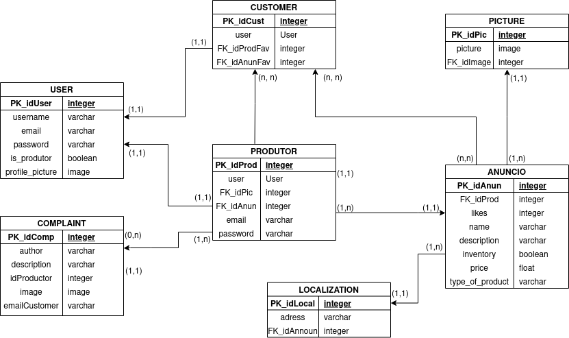

# Documento de Arquitetura de Software

## Histórico de Revisão

Data|Versão|Descrição|Autor
-|-|-|-
13/02/2021|1.0|Abertura do Documento|João Pedro
15/02/2021|1.0.1|Padronização de Documento|João Pedro
17/02/2020|1.1|Adição do tópico Representação Arquitetural|Victor Lima
19/02/2021|1.1.1|Padronização de Wiki|Carlos Eduardo e João Pedro
21/02/2021|1.2|Refatoração do tópico 2 e adição do tópico 3|João Pedro e Matheus
22/02/2021|1.3|Adição de links na parte de referências|João Pedro e Matheus
01/03/2021|1.4|Adição do tópico 4|João Pedro e Matheus 
08/03/2021|1.5|Adição do tópico "Visão de Casos de Uso"|Brenno e Matheus
09/03/2021|1.6|Adição do tópico 5|Carlos Eduardo e Lucas

## 1. Introdução

### 1.1 Finalidade

 &emsp;&emsp; O Seguinte documento tem como finalidade mostrar e esclarecer de uma forma geral a arquitetura utilizada no projeto, tornando o seu processo de entendimento o mais simples possível. Além disso, esse documento também tem como objetivo demonstrar as decisões arquiteturais tomadas pelo grupo em relação ao projeto.

### 1.2 Escopo

 &emsp;&emsp; Esse documento visa permitir ao leitor se informar sobre a arquitura utilizada no projeto, incentivando um entendimento mais simples e eficaz a cerca do produto.

### 1.3 Definições, Acrônimos e Abreviações

Abreviação|Significado
-|-
**MDS**| Métodos de Desenvolvimento de Software
**UNB**| Universidade de Brasília
**DRF**| Django REST Framework
**ORM**| Object-relational Mapping
**MVT**| Model-View-Template
**MVC**| Model-View-Controller

### 1.4 Visão Geral

 &emsp;&emsp; Esse documento de arquitetura se encontra dividido em 1 tópico, que descrevem os detalhes do software desenvolvido. Se organiza da sequinte forma: 

- Introdução: Fornece uma visão geral e introdutória sobre o documento;
- Representação Arquitetural: Fornece informações sobre as tecnologias e os motivos pelos quais elas foram escolhidas;
- Metas e Restrições: Demonstra as metas e restrições aplicadas no projeto;
- Visão de Dados: Representa a arquitetura implementada no banco de dados;

## 2. Representação Arquitetural

### 2.1 Back-end

#### 2.1.1 Django REST Framework

 &emsp;&emsp; <i>Representational State Transfer</i> ou REST, representa um conjunto de princípios e definições necessários para a criação de um projeto seguindo boas práticas e com interfaces bem definidas. O DRF então, é um framework do framework Django que permite a criação simples, ágil, poderosa e flexível de API's Web.

#### 2.1.2 Django

 &emsp;&emsp; Django é um framework web baseado em python de alto nível que preza pelo rápido desenvolvimento com um design limpo e pramático. Um dos motivos pela escolha desse framework como back-end se dá pelo fato da linguagem de desenvolvimento utilizada pelo Django ser de grande interesse dos integrantes do grupo, bem como sua crescente utilização do mercado de trabalho e sua interessante curva de aprendizado.

 &emsp;&emsp; Além disso o framework dispõe de bastante segurança através da utilização da técnica de Mapeamento objeto-relacional (ORM) que realiza queries sem se utilizar de código SQL para acesso ao banco de dados, útil para o grupo que possui poucos conhecimentos sobre Sistema de Banco de Dados.

 &emsp;&emsp; Outro ponto de interesse no framework se diz respeito da utilização do padrão Model-View-Template, modelo esse baseado no Model-View-Controller. O MVT ao contrário do MVC conta com as funções da Controller disperados pelos outros módulos e o acréscimo da Template.

- **Model**: Camada responsável pelo acesso ao banco de dados.
- **View**: Camada responsável por processar requests de usuários e retornar responses.
- **Template**: Camada responsável pela apresentação de informações ao usuário.

### 2.2 Front-End

#### 2.2.1 Flutter

 &emsp;&emsp;O Flutter é um framework desenvolvido pela Google na liguagem Dart e permite que sejam criadas aplicações nativas para os aparelhos IOS e android. Por ter essa facilidade de desenvolvimento para dois sistemas diferentes, a linguagem têm crescido bastante e tornado cada vez maior a quantidade de informação para aprendizado.

 &emsp;&emsp; Além disso, por ser uma linguagem que possui uma curva de aprendizado muito boa e alguns dos integrantes do grupo já terem conhecimento prévio relacionados a linguagem ela foi selecionada para atuar no front-end.

 &emsp;&emsp; Outro ponto importante na escolha desse framework se deve ao fato do Dart ser otimizado bem como ser especializada para criação de interfáces para usuários através do uso dos widgets (estrutura baseada no React). Assim também, o uso de <b>Blocs</b> permite que o software seja dividido em questão de interface de usuário e regras de negócio, e o uso de <b> 
Stream</b> permite eventos assíncronos no aplicativo.

### 2.3 Banco de Dados

#### 2.3.1 PostgreSQL

 &emsp;&emsp;O PostgreSQL é um poderoso, open source e objeto-relacional banco de dados que faz o uso e extenção da linguagem SQL. Por sua robustez, confiabilidade, integridade de dados e dedicação na comunidade open source essa ferramenta tem crescido e muito no mercado de trabalho, por esses motivos esse banco de dados foi escolhido para o projeto.

## 3. Metas e Restrições

### 3.1 Metas

 &emsp;&emsp; O projeto visa facilitar a divulgação dos produtos de pequenos produtores rurais bem como a sua comunicação com os possíveis compradores, através de um aplicativo online e de fácil utilização.

### 3.2 Restrições

#### 3.2.1 Compatibilidade
- O aplicativo será compatível com os aparelhos celulares que possuem o sistema operacional Android e tem acesso à Play Story, bem como é necessário o acesso à internet.

#### 3.2.2 Usabilidade
- O sistema visa ser intuitivo e de simples uso, evitando assim que a utilização não seja um empecilho.

#### 3.2.3 Confiabilidade
- A aplicação buscará obter ao menos 90% de cobertura em testes, garantindo assim a funcionalidade do sistema.

## 4. Visão de Casos de Uso

### 4.1 Atores

#### 4.1.1 Usuário

 &emsp;&emsp; Ator que compartilha as ações de produtor e comprador.

#### 4.1.2 Pequeno Produtor

 &emsp;&emsp; Especialização de usuário que compreende funcionalidades relacionadas ao anúncio e gerenciamento de produtos.

#### 4.1.3 Comprador

 &emsp;&emsp; Especialização de usuário que abrange as funcionalidades de visualização e compartilhamento de produtos e produtores, além de favoritá-los e/ou curti-los.

### 4.2 Diagrama de Casos de Uso

## 5. Visão de Implementação
### 5.1 Diagrama de Classes

### 5.2 Banco de Dados

 &emsp;&emsp; Para desenvolver e instanciar o banco de dados do projeto foi pensado quais seriam as entidades do sistema e seus atributos, além de como se relacionariam, ou seja, suas cardinalidades.

#### 5.2.1 Entidades

- Usuário
    - Comprador 
    - Produtor
- Anúncio

 &emsp;&emsp; O usuário pode ser tanto um comprador quanto um produtor, que necessita de autenticação para acessar algumas áreas do aplicativo.

#### 5.2.2 Atributos

 &emsp;&emsp; Todos os Usuários irão ter email, nome e senha, sendo o email e senha usados para acessar a conta e nome para reconhecimento.

 &emsp;&emsp; Os Compradores e Produtores poderão cadastrar uma foto de perfil. 

 &emsp;&emsp; Um Anúncio poderá ter uma ou várias fotos cadastradas, para identificar e mostrar os produtos do anúncio.

 &emsp;&emsp; Um Anúncio terá em seu cadastro número de likes, um nome, descrição e quantidade em estoque.

 &emsp;&emsp; O Produtor terá a possibilidade de adicionar uma ou mais localizações. 

#### 5.2.3 Relacionamentos

 &emsp;&emsp; Um Comprador ou Produtor poderá ter foto de perfil ou não, mas uma foto pertence a apenas 1 Comprador ou Produtor. Cardinalidade(0,n)

 &emsp;&emsp; Um Anúncio pode ser curtido por vários Compradores ou nenhum, e o Comprador pode curtir vários Anúncios ou nenhum. Cardinalidade(0,n)

 &emsp;&emsp; Um Produtor pode possuir vários Anúncios, mas um Anúncio pertence a apenas 1 Produtor. Cardinalidade(1,n)

 &emsp;&emsp; Um Anúncio pode ter nenhuma foto ou várias, mas cada foto pertence a apenas 1 Anúncio. Cardinalidade(0,n)

 &emsp;&emsp; Um Produtor pode ter várias localizações, mas cada localização pertence a apenas 1 Produtor. Cardinalidade(1.n)

#### 5.2.4 Diagrama Entidade-Relacionamento

### Referências

> About PostgreSQL. Disponível em: < [https://www.postgresql.org/about/](https://www.postgresql.org/about/) > Acesso em 01 de Março de 2021

> BloC Flutter Documentation. Disponível em: < [https://www.flutterparainiciantes.com.br/gerenciamento-de-estado/bloc](https://www.flutterparainiciantes.com.br/gerenciamento-de-estado/bloc) > Acesso em 24 de Fevereiro de 2021

> Como documentar a arquitetura de software. Disponível em: < [http://www.linhadecodigo.com.br/artigo/3343/como-documentar-a-arquitetura-de-software.aspx](http://www.linhadecodigo.com.br/artigo/3343/como-documentar-a-arquitetura-de-software.aspx) > Acesso em: 13 de Fevereiro de 2021

> Django Documentation. Disponivel em: < [https://docs.djangoproject.com/en/3.1/](https://docs.djangoproject.com/en/3.1/) > Acesso em: 22 de Fevereiro de 2021

> Documento de arquitetura Acácia. Disponível em: < [https://fga-eps-mds.github.io/2019.2-Acacia/#/architecture_document](https://fga-eps-mds.github.io/2019.2-Acacia/#/architecture_document) > Acesso em: 13 de Fevereiro de 2021

> Documento de arquitetura VCU. Disponível em: < [https://fga-eps-mds.github.io/2020.1-VC_Usuario/#/docs/Documento_de_Arquitetura](https://fga-eps-mds.github.io/2020.1-VC_Usuario/#/docs/Documento_de_Arquitetura) > Acesso em: 13 de Fevereiro de 2021

> Flutter Documentation. Disponível em: < [https://flutter.dev/docs](https://flutter.dev/docs) > Acesso em: 24 de Fevereiro de 2021

> Quickstart - Django REST framework. Disponivel em: < [https://www.django-rest-framework.org/tutorial/quickstart/](https://www.django-rest-framework.org/tutorial/quickstart/) > acesso em: 22 de Fevereiro de 2021

> TEMPLATE Documento de Arquitetura de Software. Disponível em: < [https://github.com/DroidFoundry/DroidMetronome/wiki/TEMPLATE-Documento-de-Arquitetura-de-Software](https://github.com/DroidFoundry/DroidMetronome/wiki/TEMPLATE-Documento-de-Arquitetura-de-Software) > Acesso em: 13 de Fevereiro de 2021
