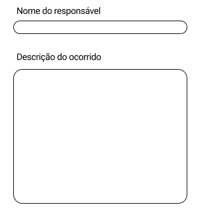
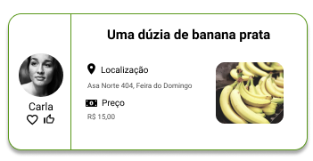
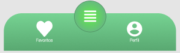

# Guia de Estilo e Manual de Identidade Visual

## Histórico de Revisão

|Data|Versão|Descrição| Autor(es)
|--|--|--|--|
|08/03/2021|1.0|Criação do documento e adição da introdução| Carlos Eduardo e Matheus Calixto|
|08/03/2021|1.1|Adição do manual de identidade, justificativas, fontes e paleta de cores|Carlos Eduardo e Matheus Calixto|
|10/03/2021|1.1.1|Adição tópico componentes|Carlos Eduardo e Matheus Calixto|
|27/03/2021|1.2|Adição da navbar do produtor| Brenno|
|28/03/2021|1.3|Revisão do documento|Joao Moura e Matheus Calixto

## 1 Introdução

 &emsp;&emsp; Este documento trata acerca do guia de estilo e manual de identdade visual do projeto Hortum.

## 2 Apresentação do Manual de Identidade Visual

<iframe src="https://docs.google.com/presentation/d/1FSgYUjd-0QNxbQLITgmn3s5ZquR5GUmQoGK9R3oVhMM/embed?start=false&loop=false&delayms=3000" frameborder="0" width="960" height="569" allowfullscreen="true" mozallowfullscreen="true" webkitallowfullscreen="true"></iframe>

## 3 Detalhamento e Justificativas
### 3.1 Nome da Aplicação

 &emsp;&emsp; Para o nome da aplicação foi traduzido a palavra "horta" para latim "hortum holerum" e escolhido a primeira palavra "hortum". A ideia de buscar um nome referente a horta vem do perfil dos usúarios da plataforma, em especial os pequenos produtores, que possuem sua renda baseada em sua propriedade.

### 3.2 Fontes

 &emsp;&emsp; As fontes utilizadas na aplicação são: 

- **Comfortaa:** (version 3.001, part of the Google Font Improvements Project), para títulos.
- **Roboto:** (Grátis, Google Android Design), para corpo do texto.

 &emsp;&emsp; As fontes são de fácil visualização e de uso gratuito. 

### Uso das fontes
#### Incluindo no HTML

 &emsp;&emsp; Usa-se o seguinte trecho de código:

~~~ 
<link rel="stylesheet" href="//fonts.googleapis.com/css?family=Comfortaa|Roboto" rel="stylesheet"/> 
~~~

#### Incluindo no CSS

 &emsp;&emsp; Usa-se no CSS:

~~~
font-family: 'Comfortaa';
font-family: 'Roboto', sans-serif;
~~~

### 4 Paleta de Cores

- Cor usada na logo.

- Cor usada na logo secundária.

Cores escolhidas baseadas no objetivo do aplicativo de anunciar produtos.

### 5 Componentes
#### 5.1 Botões

#### 5.2 Campos de formulários

 &emsp;&emsp; O texto acima do formulário é na fonte Roboto, tamanho 15 pt, O retângulo possui raio 15 pt, ambos em cor preta #000000. 

#### 5.3 Campo de anúncio

 &emsp;&emsp; O campo acima representa um exemplo de como será o anúncio, com fonte Roboto de cor preta #000000, cor do retângulo #59981A e raio 15 pt.

#### 5.3 Navbar

- **Comprador**

- **Produtor**

