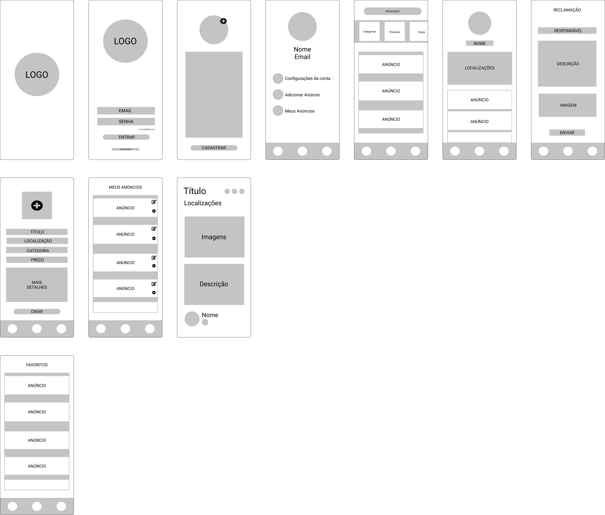

# Protótipo

## Histórico de Revisão
Data|Versão|Descrição|Autor(es)
-|-|-|-
23/02/2021|1.0|Abertura do Documento|Brenno Oliveira e Vitor Lamego
23/02/2021|1.1|Adição Protótipo Baixa Fidelidade|Brenno Oliveira e Vitor Lamego

 

## 1. Introdução

 &emsp;&emsp; Este documento tem a finalidade de demonstrar como imaginamos que o produto final se assemelhará, passando por todas as fases de visão do produto.

## 2. Protótipo de Baixa Fidelidade
