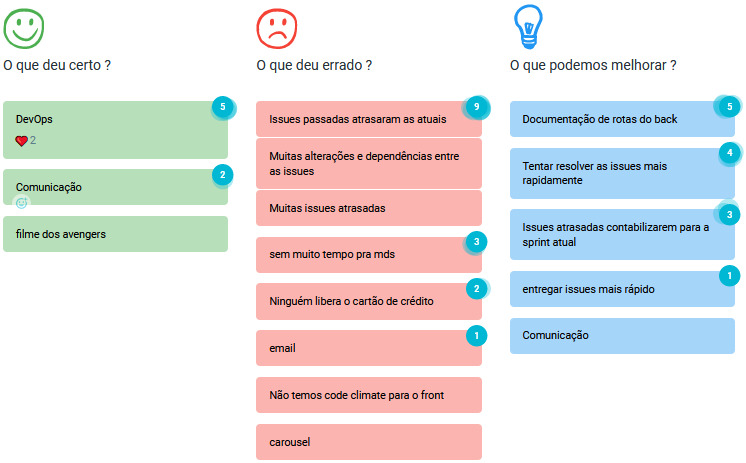
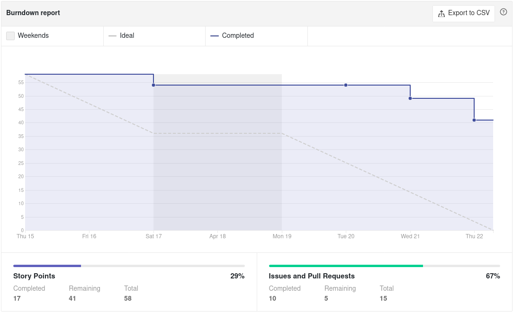
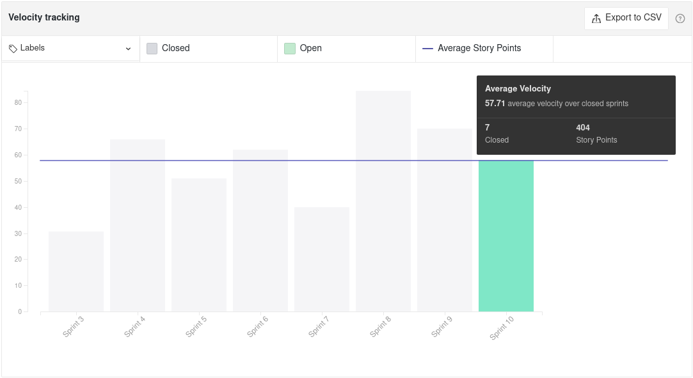
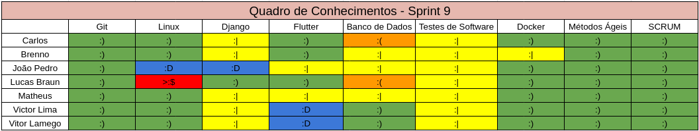
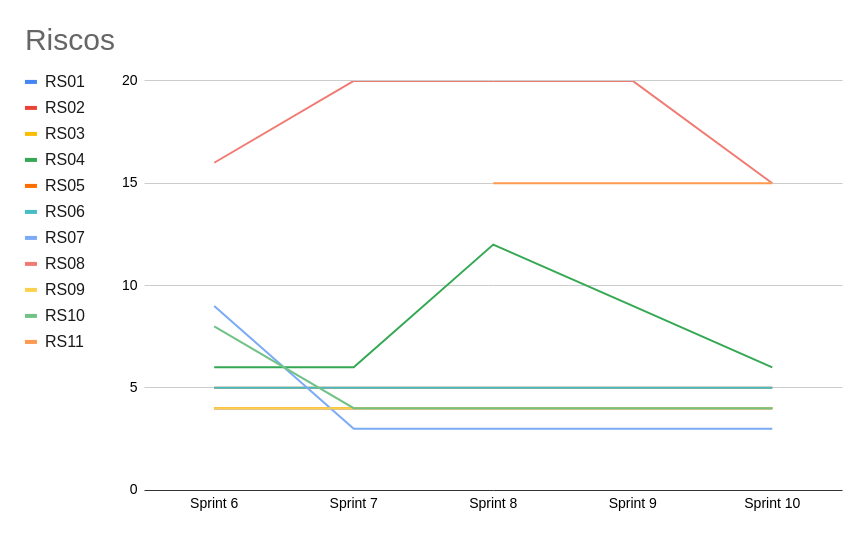

# Sprint 10 - Review

## Visão Geral
- Inicio: 15/04/2021
- Fim: 21/04/2021
- Duração: 7 dias
 
## Conclusões
| Issue | Descrição | Responsáveis | Status
|--|--|--|--|
|#98|[US12] - Visualizar Anúncios de um Produtor|João Pedro e Vitor Lamego|Concluida
|#103|[US17] - Adicionar Produtor a Lista de Favoritos|Victor Lima, Brenno e Lucas|Estendida
|#104|[US18] - Adicionar Anúncio a Lista de Favoritos|João Pedro, Victor Lima e Brenno|Estendida
|#180|Criar tela "Reclamação"|Matheus e Carlos|Estendida
|#181|Alterar ordenação de anúncios na Homepage do comprador|Matheus e Lucas|Concluida
|#182|Implementação de localização|João Pedro e Carlos|Em progresso (2 sprints)
|#183|Armazenamento de imagens|Matheus e Vitor Lamego|Em progresso (2 sprints)
|#184|Gerar documentação sobre planning sprint 10|João Pedro|Concluida
|#185|Gerar documentação sobre review sprint 9|João Pedro|Concluida

## Retrospective

## Quadro de Burndown

## Quadro de Velocity

<!-- ## Quadro de Conhecimentos
 -->

## Quadro de Evolução dos Riscos

## Pareamentos
- João Pedro e Vitor Lamego
- Victor Lima, Brenno e Lucas
- João Pedro, Victor Lima e Brenno
- Matheus e Carlos

## Análise do Scrum Master
- Nessa sprint o grupo teve que focar em resolver issues não concluidas da sprint passada e por esse motivo algumas issues dessa sprint tiveram que ser estendidas. O nível de cansaço do grupo está mais alto além de estarmos chegando ao final do semestre resultando em uma menor produtividade. Para recuperar isso, a equipe resolveu excluir 4 User Storys buscando manejar toda a carga de trabalho para funcionalidades ja semi finalizadas.
