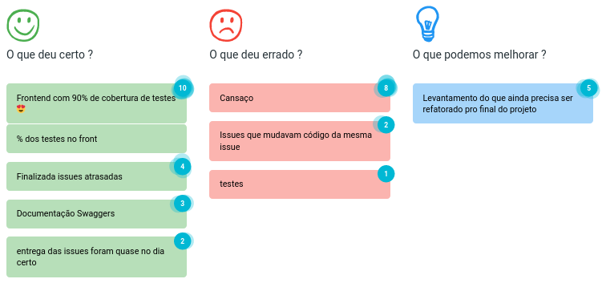
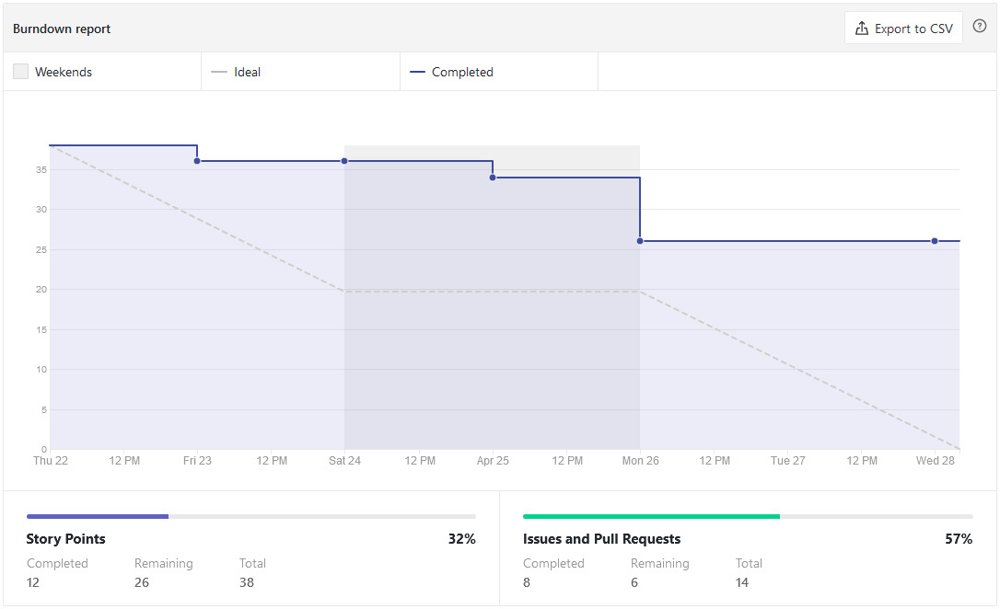
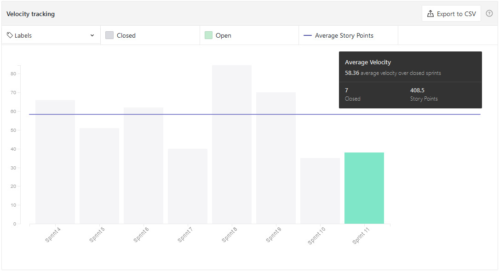
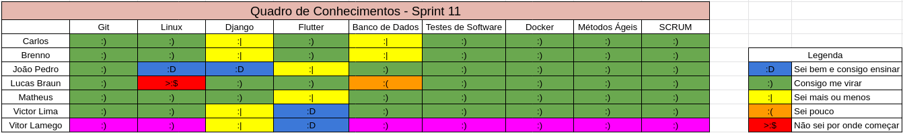
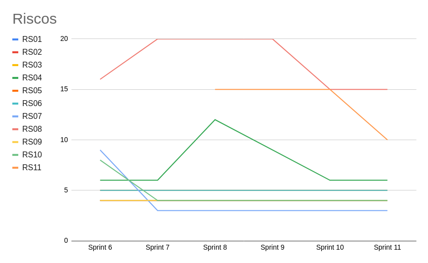

# Sprint 11 - Review

## Visão Geral
- Inicio: 22/04/2021
- Fim: 28/04/2021
- Duração: 7 dias
 
## Conclusões
| Issue | Descrição | Responsáveis | Status
|--|--|--|--|
|#89|[US02] - Apagar Conta|João Pedro e Brenno|Concluida
|#107|[US21] - Denunciar Usuário|Matheus e Carlos|Concluida
|#192|Adição do Swaggers|João Pedro e Matheus|Concluida
|#193|Adição de testes ao frontend|Vitor Lamego, Carlos e Lucas|Concluida
|#194|Adição de número de telefone do produtor|João Pedro e Victor Lima|Estendida
|#195|Gerar documentação sobre review sprint 10|João Pedro|Concluida
|#196|Gerar documentação sobre planning sprint 11|João Pedro|Concluida

## Retrospective

## Quadro de Burndown

## Quadro de Velocity

## Quadro de Conhecimentos

## Quadro de Evolução dos Riscos

## Pareamentos
- João Pedro e Brenno
- Matheus e Carlos
- Vitor Lamego, Carlos e Lucas
- João Pedro e Victor Lima
- João Pedro e Matheus

## Análise do Scrum Master
- Sprint produtiva pois quase todas as issues atrasadas foram concluidas bem como as issues da sprint. Com isso o projeto se aproxima de um fim com sucesso visto a menor quantidade de user storys necessárias para finalizar. Vale a pena citar que o grupo tem gostado de produzir o projeto e isso permite que, apesar do cansaço, um desenvolvimento de um produto de qualidade. A equipe também sentiu a necessidade de se levantar as refatorações necessárias tanto no backend como no frontend, para as próximas sprints. E por fim, parabenizar todos os envolvidos por elevar a cobertura de testes do front para 93%.
