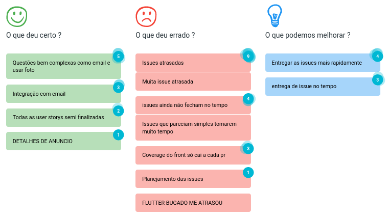
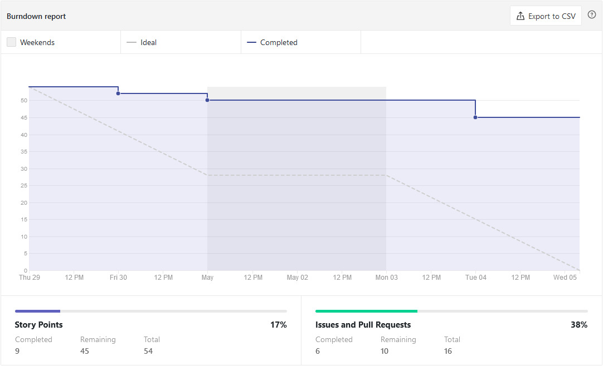
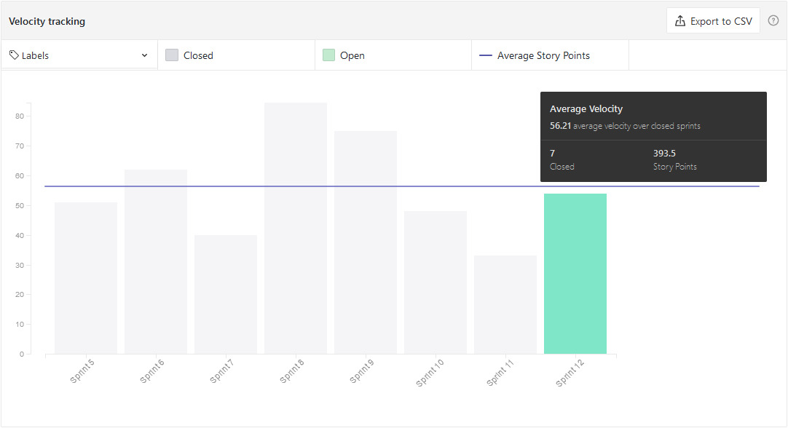
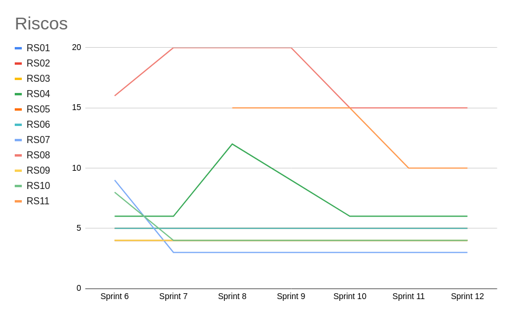

# Sprint 12 - Review

## Visão Geral
- Inicio: 29/04/2021
- Fim: 05/05/2021
- Duração: 7 dias
 
## Conclusões
| Issue | Descrição | Responsáveis | Status
|--|--|--|--|
|#91|[US05] - Redefinir Senha|Carlos e Lucas|Estendida
|#99|US13] - Visualizar Localizações de um Anúncio|João Pedro e Brenno|Estendida
|#100|[US14] - Pesquisar Localização|João Pedro e Brenno|Estendida
|#204|Correções na tela detalhes do produtor|Vitor Lamego|Concluida
|#205|Refatorações na página de criar anúncio|Brenno|Concluida
|#207|Atualizar Documentação|João Pedro, Carlos e Matheus|Concluida
|#208|Correção de categorias|Victor e Matheus|Estendida
|#209|Integrar imagens ao frontend|Vitor Lamego e Victor Lima|Estendida
|#210|Gerar documentação sobre planning sprint 12|João Pedro|Concluida
|#211|Gerar documentação sobre review sprint 11|João Pedro|Concluida
|#214|Implementação do Dio no lugar do http|Vitor Lamego|Concluida

## Retrospective

## Quadro de Burndown

## Quadro de Velocity

<!-- ## Quadro de Conhecimentos -->

## Quadro de Evolução dos Riscos

## Pareamentos
- Carlos e Lucas
- João Pedro e Brenno
- Victor Lima e Matheus
- Victor Lima e Vitor Lamego

## Análise do Scrum Master
- Sprint em que faltou-se um pouco mais de planejamento visto que as issues tiveram uma dificuldade mais elevada que o esperado. Por conta disso quase metade das issues ficaram atrasada, porém ja bem avançadas. O cansaço do grupo tem aumentado bastante e com isso a quantidade de código sofreu uma queda. Entretando essa sprint foi importante pois todas as user storys tiveram seu início e quase finalização, sendo necessário apenas alguns ajustes finais.
