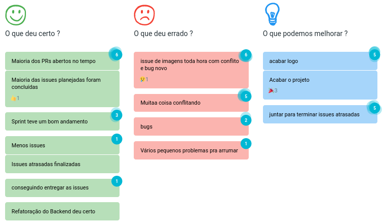
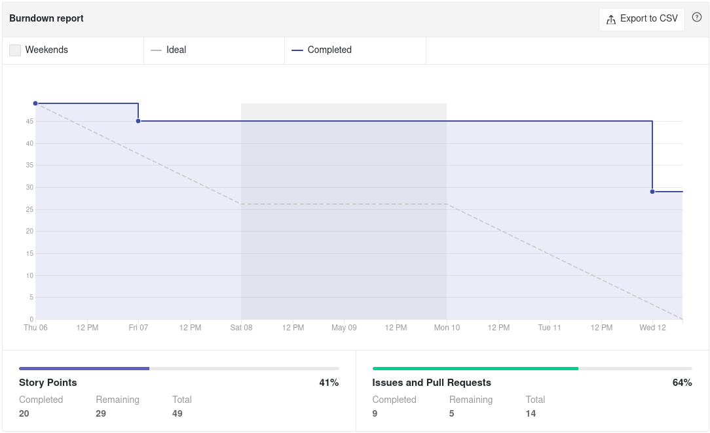
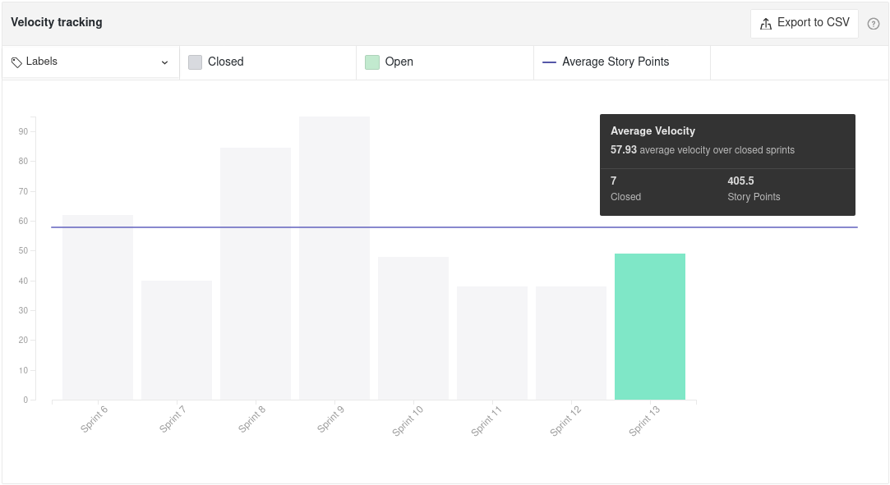
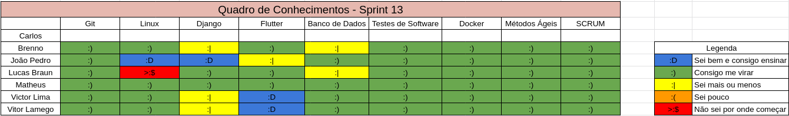
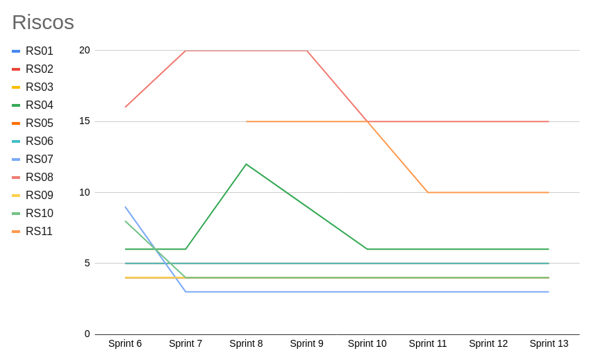

# Sprint 13 - Review

## Visão Geral
- Inicio: 06/05/2021
- Fim: 12/05/2021
- Duração: 7 dias
 
## Conclusões
| Issue | Descrição | Responsáveis | Status
|--|--|--|--|
|#219|Deixar anúncio invisível|Carlos e Lucas|Concluida
|#220|Diminuir tamanho dos nomes|Lucas|Concluida
|#221|Refatoração no backend|João Pedro|Estendida
|#222|Deploy na Play Store|Matheus e Carlos|Estendida
|#223|Utilização do endereço do Heroku|Victor Lima|Concluida
|#224|Melhoria visual do footer|Vitor Lamego|Concluida
|#225|Gerar documentação sobre review sprint 12|João Pedro|Concluida
|#226|Gerar documentação sobre planning sprint 13|João Pedro|Concluida

## Retrospective

## Quadro de Burndown

## Quadro de Velocity

## Quadro de Conhecimentos

## Quadro de Evolução dos Riscos

## Pareamentos
- Carlos e Lucas
- Matheus e Carlos

## Análise do Scrum Master
- Sprint muito boa, pois conseguimos concluir muitas coisas atrasadas e a refatoração do back ficou pronta sendo necessário apenas a revisão. Ainda faltam algumas issues atrasadas porém todas estão no processo de revisão. O grupo focou bastante em realmente finalizar tudo nessa semana para evitar mais atrasos no deploy para a playstore e também para termos uma sprint 14 (Release 2) mais tranquila.
