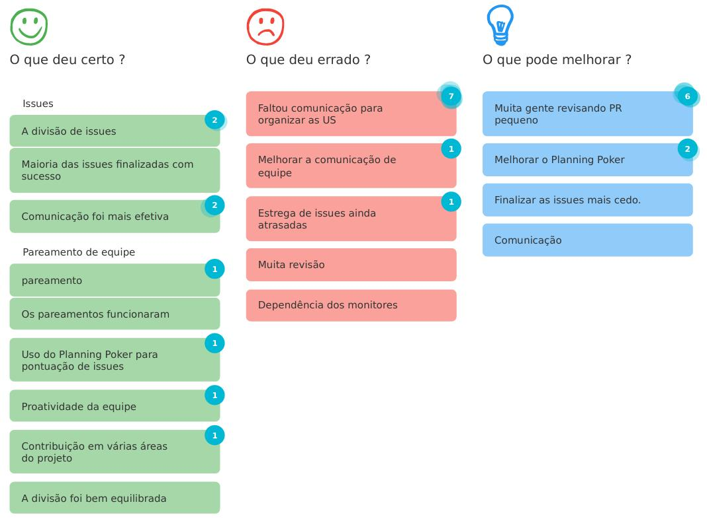
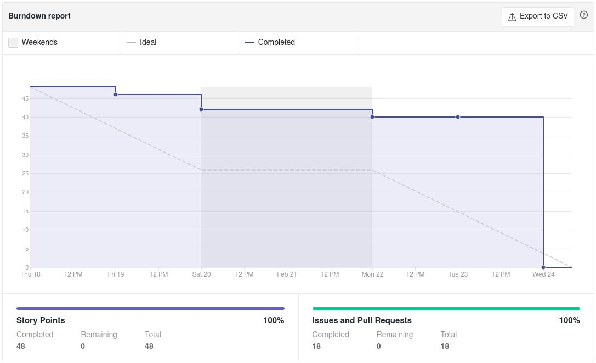

# Sprint 2 - Review

## Visão Geral
- Inicio: 18/02/2021
- Fim: 24/02/2021
- Duração: 7 dias
 
## Conclusões
| Issue | Descrição | Responsáveis | Status
|--|--|--|--|
|#20|Pesquisa/Base sobre Front-end (Flutter)|Victor Lima e Carlos|Concluida
|#21|Pesquisa/Base sobre Back-end (Django)|João Pedro e Matheus|Concluida
|#22|Pesquisa/Base sobre Docker|Brenno e Vitor Lamego|Concluida
|#23|Protótipo de Baixa Fidelidade|Brenno e Vitor Lamego|Concluida
|#24|Incrementação do Documento de arquitetura|João Moura e Matheus|Concluida
|#25|Gerar documentação sobre review sprint 1|João Moura|Concluida
|#26|Gerar documentação sobre planning sprint 2|João Moura|Concluida
|#27|Modularização do repositório|Vitor Lamego|Concluida
|#28|Revisão das User Stories|Toda a equipe|Estendida
|#29|Padronização e edição dos arquivos|João Moura e Carlos|Concluida

## Retrospective

## Quadro de Burndown

## Quadro de Conhecimento

## Pareamentos
- Victor Lima e Carlos
- João Pedro e Matheus
- Brenno e Vitor Lamego

## Análise do Scrum Master
- Nessa sprint o grupo demonstrou uma proatividade muito boa visto a quantidade de issues realizadas, além de uma comunicação maior. A issue #28 (Revisão de User Stories) foi estendida por mais um dia (reunião marcada no dia 26/02) para se definir corretamente o escopo do produto a ser feito. Apesar disso, analisando-se o quadro de burndown é perceptível um atraso na entraga das issues bem como a pontuação realizada no **Planning Poker** ser muito alta em relação à algumas issues (ex.: issues de pesquisa e issue sobre protótipo).
