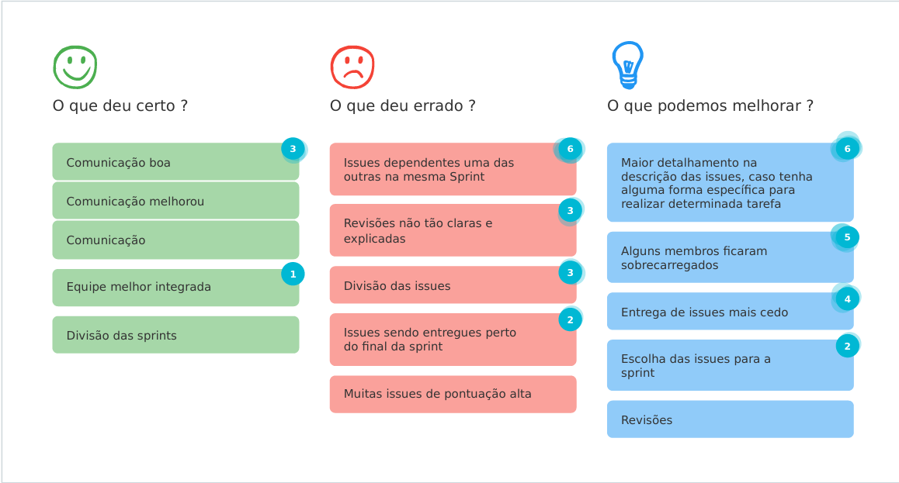

# Sprint 4 - Review

## Visão Geral
- Inicio: 04/03/2021
- Fim: 10/03/2021
- Duração: 7 dias
 
## Conclusões
| Issue | Descrição | Responsáveis | Status
|--|--|--|--|
|#45|Protótipo de alta fidelidade|Brenno, Carlos e Vitor Lamego|Concluida
|#58|Implementação do Banco de Dados|Lucas, Vitor Lamego e Victor Lima|Concluida
|#59|Gerar documentação sobre review sprint 3|João Pedro|Concluida
|#60|Gerar documentação sobre planning sprint 4|João Pedro|Concluida
|#61|[US] - Cadastro de conta|João Pedro e Victor Lima|Estendida
|#65|Documentação de Casos de Uso|Brenno e Matheus|Conckuida
|#66|Definir identidade visual do projeto|Matheus e Carlos|Concluida
|#67|Melhorar documento de banco de dados|Carlos e Lucas|Concluida
|#68|Treinamento backend e suas tecnologias|João Pedro e Matheus|Retirada
|#69|Treinamento frontend e suas tecnologias|Vitor Lamego e Victor Lima|Retirada

## Retrospective

## Quadro de Burndown

## Quadro de Velocity

## Pareamentos

## Análise do Scrum Master
- Nessa sprint o grupo demonstrou uma comunicação muito maior em relação às demais sprints, tornando-a muito produtiva. Apesar de ser bem produtiva, o grupo sofreu com algumas dificuldades nas issues #58 e #61 (codificação e aprendizagem com o django) que levou a issue #61 ser estendida para mais dois dias. Outro ponto importante dessa issue é que os treinamentos (#68 e #69) foram retirados da sprint, porém serão realizados de forma prática em issues de programação ou user stories.
