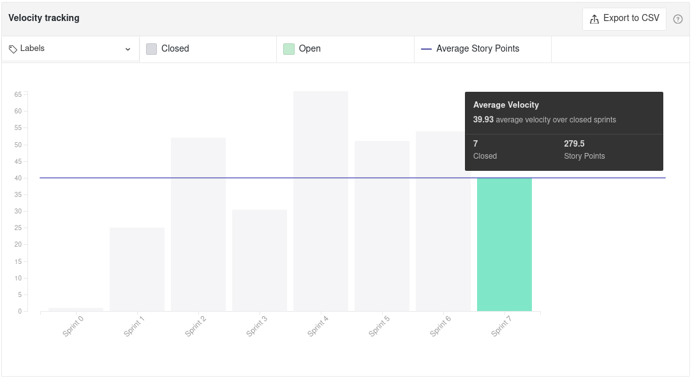

# Sprint 7 - Review

## Visão Geral
- Inicio: 25/03/2021
- Fim: 31/03/2021
- Duração: 7 dias
 
## Conclusões
| Issue | Descrição | Responsáveis | Pontuação
|--|--|--|--|
|#90|[US04] - Sair da Conta|Carlos|Concluida
|#127|Revisar documentação do repositório|Todos da equipe|Concluida
|#128|Preparação e apresentação para a Release 1|Todos da equipe|Concluida
|#129|Padronização das pastas/components/pages do frontend|Victor Lima e Vitor Lamego|Concluida
|#130|Criar rota para utilização dos anúncios|Lucas e Matheus|Concluida
|#131|[Hotfix] Navbar produtor|Brenno|Concluida
|#132|Gerar documentação sobre review sprint 6|João Pedro|Concluida
|#133|Gerar documentação sobre planning sprint 7|João Pedro|Concluida

## Retrospective

## Quadro de Burndown

## Quadro de Velocity

## Quadro de Conhecimentos

## Pareamentos
- Victor Lima e Vitor Lamego
- Lucas e Matheus

## Análise do Scrum Master
- Essa foi uma sprint mais tranquila visto a necessidade de prepararação e apresentação da release 1. Com isso, apenas um user story de prioridade mais baixa foi realizada além da padronização de pastas do Frontend. E por fim a issue #70 (Implementação do heroku) foi estendida mais uma vez e em decorrência da sua dificuldade, o membro Carlos também foi deslocado para sua realização.
