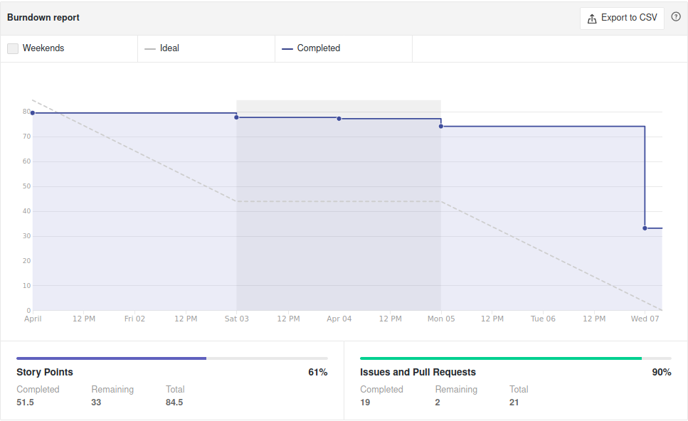
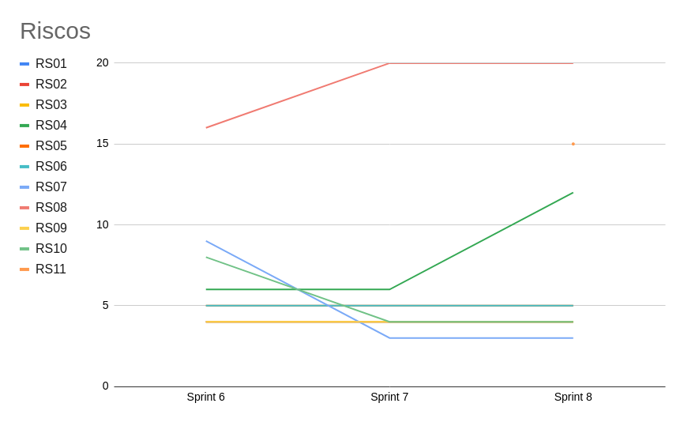

# Sprint 8 - Review

## Visão Geral
- Inicio: 01/04/2021
- Fim: 07/04/2021
- Duração: 7 dias
 
## Conclusões
| Issue | Descrição | Responsáveis | Pontuação
|--|--|--|--|
|#94|[US08] - Editar Anúncio|João Pedro, Victor Lima e Brenno|Concluida
|#95|[US09] - Excluir Anúncio|João Pedro e Brenno|Estendida
|#138|Melhorar documentação do Django e Django-rest|Carlos|Concluida
|#139|Melhorar o canvas do produto|Carlos|Concluida
|#140|Iniciar os testes unitários e de integração das issues passadas|Victor Lima, Vitor Lamego e Lucas|Concluida
|#141|Linkar o backend do list de anúncios com o frontend|Vitor Lamego e Lucas|Concluida
|#142|Implementação do Login automático|João Pedro e Brenno|Concluida
|#143|Criar template para Hotfix|Brenno|Concluida
|#144|Estudo e implementação de CI|Matheus e Carlos|Concluida
|#145|Gerar documentação sobre planning sprint 8|João Pedro|Concluida
|#146|Gerar documentação sobre review sprint 7|João Pedro|Concluida

## Retrospective

## Quadro de Burndown

## Quadro de Velocity

## Quadro de Evolução dos Riscos

## Pareamentos
- João Pedro Victor Lima e Brenno
- João Pedro e Brenno
- Victor Lima, Vitor Lamego e Lucas
- Vitor Lamego e Lucas
- Matheus e Carlos

## Análise do Scrum Master
- Sprint muito importante para a equipe pois agora entramos em um momento de muita codificação, com testes, user storys e novas melhorias. A destinação de dois mebros para o DevOps foi benéfica para a equipe, pois assim os integrantes responsáveis conseguiram implementar o Heroku além de providenciar a integração contínua do código. O grupo se encontra muito motivado com o projeto e isso tem possibilitado uma comunicação muito eficiente e o desenvolvimento de uma grande pontuação de issues durante as sprints.
