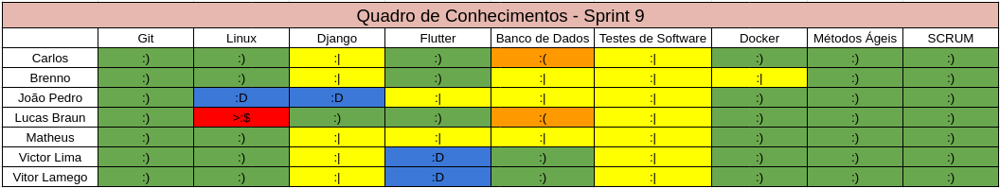

# Sprint 9 - Review

## Visão Geral
- Inicio: 09/04/2021
- Fim: 15/04/2021
- Duração: 7 dias
 
## Conclusões
| Issue | Descrição | Responsáveis | Status
|--|--|--|--|
|#92|[US06] - Atualizar Dados de Usuário|Brenno e Carlos|Estendida
|#96|[US10] - Pesquisar Produtor|Vitor Lamego e Lucas|Concluida
|#97|[US11] - Procurar Produto|João Pedro e Lamego|Concluida
|#157|Linkar Backend com a homepage do Produtor|Matheus e Lucas|Estendida
|#158|Refatorar viewsets de anúncio|João Pedro e Vitor Lamego|Concluida
|#159|Melhoria da Visão Lógica|Carlos|Concluida
|#160|Melhoria do Canvas|Todos da equipe|Concluida
|#161|Criação da tela Detalhes Anúncio|Victor Lima|Estendida
|#162|Codequality, lint (CI e CD)|Matheus e Carlos|Concluida
|#163|Interações com email|Victor Lima, Brenno e Lucas|Em progresso (2 sprints)
|#164|Implementação dos testes que faltam|Carlos, Brenno e João Pedro|Concluida
|#165|Gerar documentação sobre review sprint 8|João Pedro|Concluida
|#166|Gerar documentação sobre planning sprint 9|João Pedro|Concluida

## Retrospective

## Quadro de Burndown

## Quadro de Velocity

## Quadro de Conhecimentos

## Quadro de Evolução dos Riscos

## Pareamentos
- João Pedro e Vitor Lamego
- Lucas e Vitor Lamego
- Brenno e Carlos
- Matheus e Lucas

## Análise do Scrum Master
- Nessa sprint todos da equipe ficaram sobrecarregados com a alta quantidade de pontos, porém isso tornou possível sprints futuras com menos pontos visto as bases ja estarem prontas bastando realizar a implementação. A equipe está começando a sentir o peso da aproximação do final do semestre, porém isso tem motivado o grupo a continuar produtivo e entregar um trabalho de qualidade.
